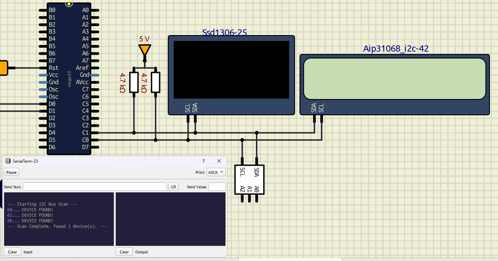

# ATMega32 I<sup>2</sup>C / TWI Driver

This is a custom TWI / I<sup>2</sup>C driver written in C for the ATMega32 AVR microcontroller from Atmel/Microchip.

## Content
- [What is this?](#what-is-this)
- [The Challenge](#the-challenge)
- [Features](#features)
- [Hardware requirements](#hardware-requirements)
- [Software requirements](#software-requirements)
- [Project layout](#project-layout)
- [How it works](#how-it-works)
    - [Step 1: Include the driver](#step-1-include-the-driver)
    - [Step 2: Initialize it](#step-2-initialize-it)
    - [Step 3: Start a transmission](#step-3-start-a-transmission)
    - [Reading data](#reading-data)
- [Manual event-handling mode](#manual-event-handling-mode)
- [Example application: I2C bus scanner](#example-application-i2c-bus-scanner)
- [Building and flashing](#building-and-flashing)
- [API overview](#api-overview)
- [Current limitations](#current-limitations)
- [The datasheet](#the-datasheet)

## What is this?
A custom I<sup>2</sup>C driver for the TWI interface on the ATMega32. It is a HAL, or Hardware Abstraction Layer: it allows the developer to focus on developing actual features rather than worrying about the underlying hardware changes and operations. It provides a set of functions that perform those operations behind the scenes and simplifies development for people who do not want to implement the complete TWI state machine themselves.

The driver currently provides master-mode data transmission and reception. It can process transactions using TWI interrupts, or the application can call the event handler manually when interrupts are disabled.

If you need help with how any of the functions work, they are documented in [TWI_interface.h](TWI/TWI_interface.h).



## The Challenge
Why did I even make this? Well I've been recently moving from dev boards to bare metal microcontrollers, I have been using an ATMega32A for the past few weeks and having lots of fun with it. After a few weeks I realized how dependent I am on google and AI tools to write C for me because it's kinda difficult with bare metal, and I felt like it was inhibiting my problem solving skills, cause why use your brain when you can use AI, right? So I wanted to train myself a little by writing code on my own, I wanted to work with OLED displays so I thought, why not make an I<sup>2</sup>C driver for fun, but only using information found in the [datasheet](https://ww1.microchip.com/downloads/en/DeviceDoc/doc2503.pdf) of the ATMega32, no AI, no Google, no Reddit, and certainly no StackOverflow. I didn't think I'd get this far but apparently I underestimated myself.

## Features

- Master-mode TWI write transactions.
- Master-mode TWI read transactions.
- Interrupt-based transaction handling.
- Optional manual transaction handling through `TWI_vIntHandler()`.
- Seven-bit slave addressing. The driver adds the read/write bit to the address.
- Busy-state protection so a new transaction cannot overwrite an active one.
- Basic transaction success/failure reporting.
- Helper functions for configuring the TWI bit-rate register and clock prescaler.
- An example application that scans the I<sup>2</sup>C bus and reports detected devices over UART.

### Planned features
- Automatic bit-rate register calculation
- Better manual mode
- Slave transmitter and slave receiver modes
- Better status reports
- More optimized and faster code

## Hardware requirements

This project is written for an ATmega32/ATmega32A using the AVR TWI peripheral. The example application assumes:

- A 16 MHz CPU clock.
- An I<sup>2</sup>C device connected to the MCU's TWI pins.
- Pull-up resistors on SDA and SCL. I<sup>2</sup>C lines are open-drain/open-collector and normally cannot work reliably without pull-ups.
- A shared ground between the MCU and the connected I<sup>2</sup>C device.
- A USB-to-TTL serial adapter if you want to view the bus scanner output.

On the ATmega32, the TWI pins are PC1/SDA and PC0/SCL. The example UART uses PD1/TXD for output. Connect the MCU's TX pin to the adapter's RX pin, and connect their grounds together.

The driver accepts seven-bit addresses such as `0x3C`. Do not shift the address before passing it to `TWI_bSendData()` or `TWI_bReadData()`; the driver shifts it and adds the direction bit internally.

## Software requirements

You need an AVR C toolchain containing:

- `avr-gcc`
- `avr-libc`
- A programmer or bootloader tool for flashing the ATmega32
- A serial terminal configured for 9600 baud, 8 data bits, no parity, and one stop bit when using the example application

There is currently no standalone build script in this repository. The source files can be added to an AVR project and compiled for the `atmega32` target.

## Project layout

```text
main.c                         Example I2C bus scanner
TWI/TWI_interface.h            Public TWI API
TWI/TWI_program.c              TWI register operations and state machine
UART-for-example-script/UART/  UART and logging support for the scanner
build/                         Existing build output
```

The TWI driver itself only needs the files in the `TWI` directory. The UART and logger files are used by `main.c` to make the example application observable through a serial terminal.

## How it works

The driver uses the ATmega32 TWI status register as a small state machine:

1. `TWI_bSendData()` or `TWI_bReadData()` stores the transaction parameters and starts a START condition.
2. When the TWI hardware completes an event, it sets the `TWINT` flag.
3. If interrupts are enabled, the `TWI_vect` ISR calls `TWI_vIntHandler()` automatically.
4. The handler reads the current TWI status code from `TWSR` and decides whether to send the slave address, send a data byte, receive a data byte, acknowledge a byte, or end the transaction.
5. An acknowledged transaction ends with a STOP condition and a successful status. A NACK or arbitration error ends with a STOP condition and a failed status.

The driver only processes one transaction at a time. `TWI_bIsBusy()` can be used to wait for the current transaction to finish before starting another one.

## How to use it

Guide on how to get things started.

### Step 1: Include the driver

Include the TWI interface and the AVR headers needed by your application:

```c
#include <avr/io.h>
#include <avr/interrupt.h>
#include "TWI_interface.h"
```

### Step 2: Initialize it

The second argument determines whether event-based interrupt handling is enabled. Interrupt mode is the recommended mode because the TWI peripheral can advance the transaction while the main application does other work.

The current implementation is configured for 400 kHz when the CPU clock is 16 MHz. The `u32Freq` argument is accepted by the API, but the current implementation does not calculate a new bit-rate value from it; it currently writes a fixed bit-rate value of 19 with a prescaler of 1.

```c
#define F_CPU 16000000UL

#include <avr/io.h>
#include <avr/interrupt.h>
#include "TWI_interface.h"

int main(void)
{
    TWI_vInit(400000, TWI_ENABLE_INTERRUPT);
    sei();

    // Application code goes here.
}
```

### Step 3: Start a transmission

Pass a seven-bit slave address, a data buffer, and the number of bytes to send. `TWI_bSendData()` returns `true` when the transaction is accepted and started. It returns `false` if another transaction is already in progress.

```c
u8 dataArray[] = {0, 1, 2, 3};
u8 dataSize = sizeof(dataArray) / sizeof(dataArray[0]);
u8 address = 0x3C;

if (!TWI_bSendData(address, dataArray, dataSize))
{
    // A transaction is already in progress.
}

while (TWI_bIsBusy())
{
    // The interrupt handler advances the transaction in the background.
}

if (TWI_boolGetTransactionStatus())
{
    // The slave acknowledged the transaction.
}
else
{
    // The transaction failed, for example because the slave did not respond.
}
```

`TWI_boolGetTransactionStatus()` currently returns a Boolean success value, it does not return the raw TWI status code. The raw status code is used internally by `TWI_vIntHandler()` to choose the next state.

### Reading data

Reading uses the same asynchronous pattern, but the buffer is filled by the driver:

```c
u8 receivedData[4];
u8 address = 0x3C;

if (TWI_bReadData(address, receivedData, 4))
{
    while (TWI_bIsBusy())
    {
        // Wait for the interrupt-driven transaction to finish.
    }
}
```

Only use `receivedData` after `TWI_bIsBusy()` becomes false, and check `TWI_u8GetTransactionStatus()` before treating its contents as valid.

## Manual event-handling mode

To disable TWI interrupts, initialize the driver with `TWI_DISABLE_INTERRUPT`:

```c
TWI_vInit(400000, TWI_DISABLE_INTERRUPT);

if (TWI_bSendData(address, dataArray, dataSize))
{
    while (TWI_bIsBusy())
    {
        if (TWCR & (1 << TWINT))
        {
            TWI_vIntHandler();
        }
    }
}
```

In this mode, the application is responsible for checking `TWINT` and calling `TWI_vIntHandler()` for every completed TWI event. Calling the handler once is not enough to complete a multi-byte transaction.

## Example application: I2C bus scanner

The included [main.c](main.c) initializes the UART and TWI drivers, enables global interrupts, and checks the common seven-bit address range from `0x08` through `0x77`. For each address it starts a zero-byte write transaction. A device is reported as found when it acknowledges its address.

The scanner sends its output through UART at 9600 baud:

```text
--- Starting I2C Bus Scan ---
60... DEVICE FOUND!
--- Scan Complete. Found 1 device(s). ---
```

The address is printed in decimal by `LOGGER_voidPrintNumber()`. For example, decimal `60` is hexadecimal `0x3C`. The exact output depends on which devices are connected to the bus.

Here's a video of it working in real life! (I muted the video cause it was in Arabic)
<video src="https://github.com/user-attachments/assets/1512b62e-2e80-49e0-8581-e0ca6aece3a9" width="100%" controls autoplay loop></video>
In the video I have 4 I<sup>2</sup>C devices conntected on the same bus, the ATMega32 providing clock to the bus, and a Raspberry Pi Pico working as a UART bridge, sending the terminal output from the ATMega to my laptop, the terminal shows 5 addresses as the Servo Motor Driver I pointed to has 2 addresses it replies to.

## Building and flashing

The repository does not currently include a Makefile or flashing script. In an AVR project, compile the application together with the TWI source and the UART/logger sources, select the ATmega32 device, and define the CPU clock as 16 MHz.

A command-line build will generally follow this shape:

```text
avr-gcc -mmcu=atmega32 -DF_CPU=16000000UL \
    main.c \
    TWI/TWI_program.c \
    UART-for-example-script/UART/UART_program.c \
    UART-for-example-script/UART/LOGGER_program.c \
    -o main.elf
```

The exact command may need additional include paths or linker options depending on the AVR toolchain and the programmer being used. After producing a HEX file from the ELF file, flash it to the ATmega32 with the programmer appropriate for your hardware.

There's already a prebuilt .hex file in /build so you can test out the bus scanner example.

## API overview

- `TWI_vInit()` enables the TWI peripheral and configures the current bit-rate settings.
- `TWI_bSendData()` starts a master write transaction.
- `TWI_bReadData()` starts a master read transaction.
- `TWI_bIsBusy()` reports whether a transaction is still active.
- `TWI_boolGetTransactionStatus()` reports the success flag for the latest transaction.
- `TWI_vIntHandler()` advances the state machine and is called by the TWI ISR in interrupt mode.
- `TWI_vSetOwnSlaveAddress()` and `TWI_vAcknowledgeOwnAddress()` configure the MCU for responding as a slave.

See [TWI_interface.h](TWI/TWI_interface.h) for the complete public API and parameter descriptions.

## Current limitations
- The public transaction status function exposes only a Boolean success value, not the detailed TWI status code.
- The driver is designed around one active transaction and does not queue requests.
- The application must keep transaction buffers valid until the transaction finishes because the driver stores a pointer to the caller's buffer.
- The driver does not configure TWI pull-up resistors; they must be provided by the hardware.

## The datasheet

The driver was written by following the ATmega32 datasheet, especially the TWI status-code table and register descriptions:

[ATmega32 datasheet](https://ww1.microchip.com/downloads/en/DeviceDoc/doc2503.pdf)

## AI Usage Declaration
Qwen AI was used to help with the new OLED script